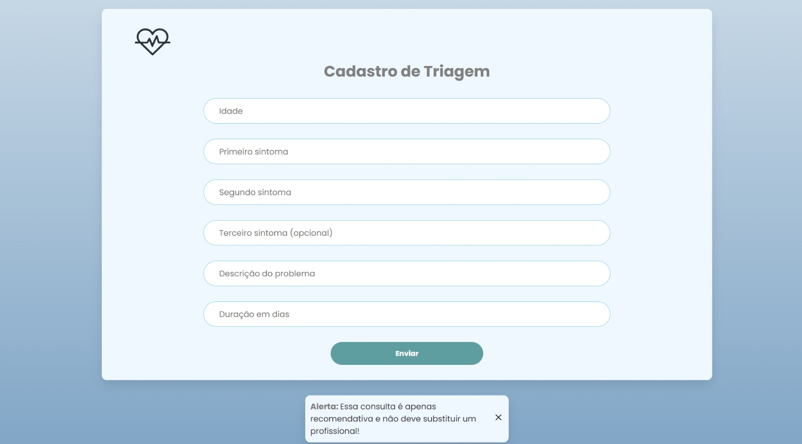
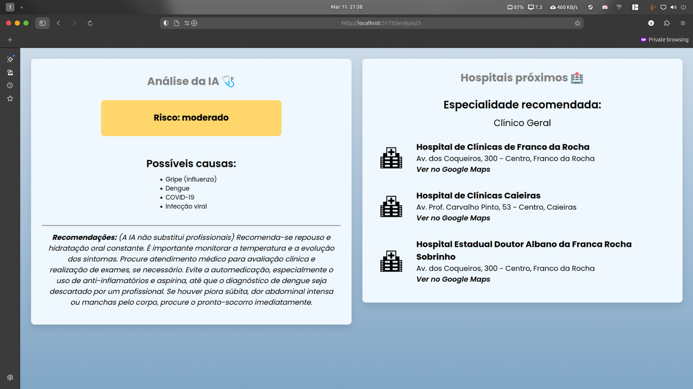
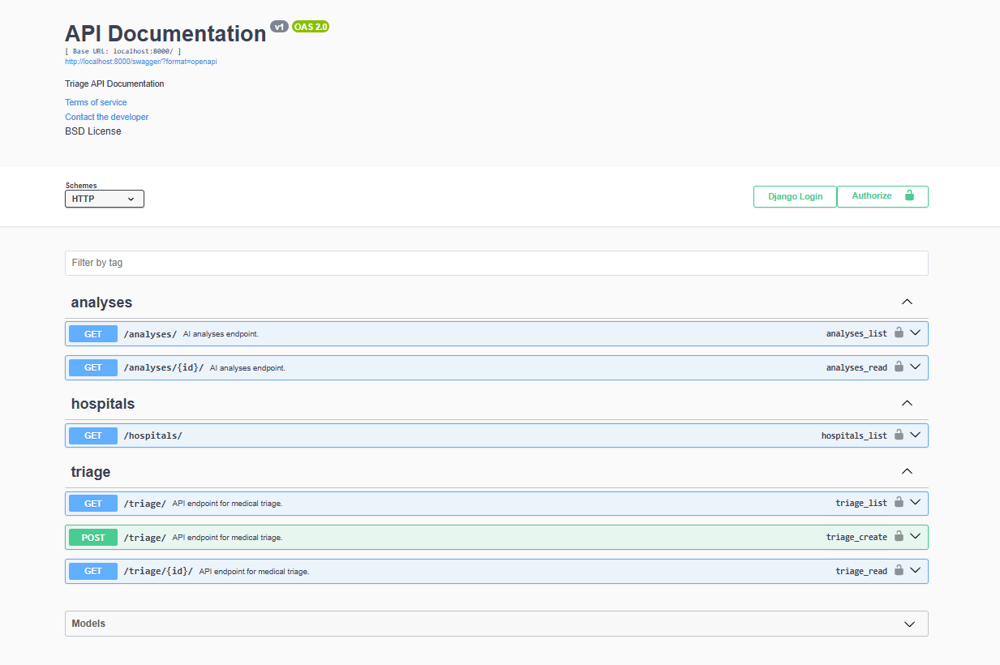
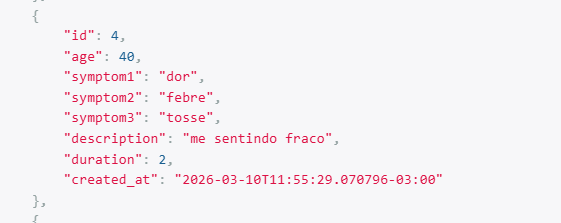
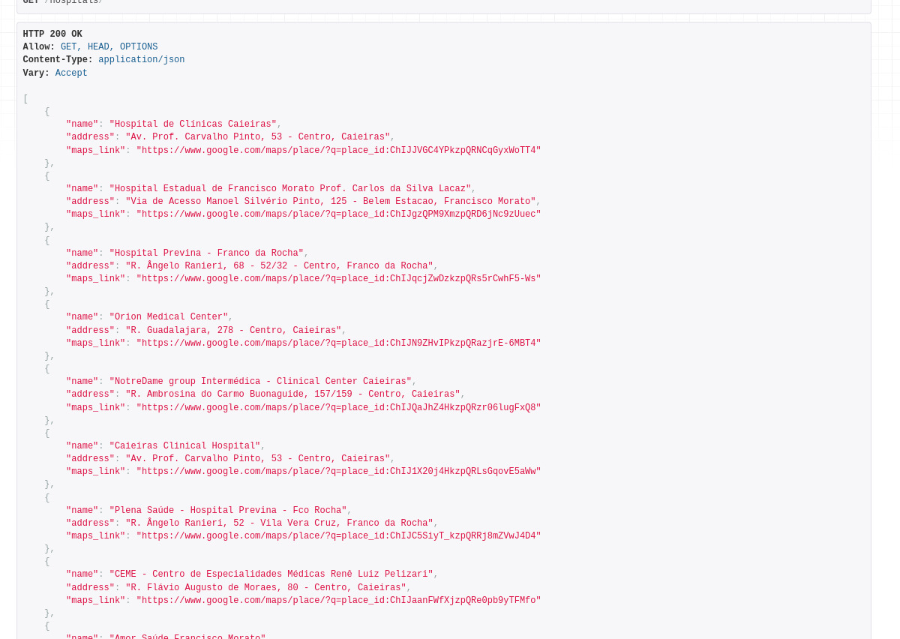
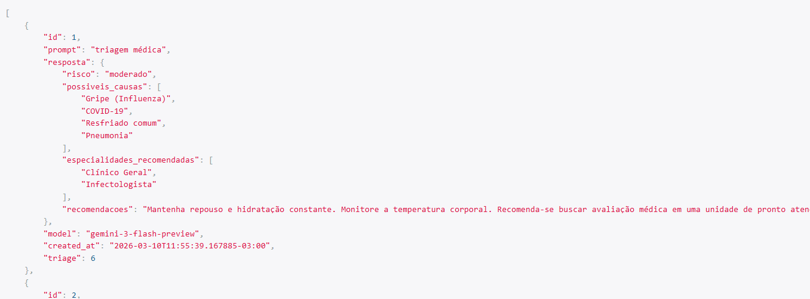

# AI Medical Triage

Medical triage API that uses AI to analyze symptoms and suggest the closest hospitals.

The system receives symptom data, generates a risk analysis using AI, and returns the closest hospitals through the Google Maps API.

---

# Demonstration 

## Triage Interface


## Analysis Interface


## Swagger Documentation


## Example Request


## Hospital Results


## AI Response


---

# Architecture

System flow:

User Symptoms

↓

POST /triage/

↓

Gemini AI analysis

↓

GET /analyses/?triage={id}

↓

GET /hospitals/?lat=&lng=&speciality=

---

# Tech Stack

Backend:

- Python
- Django
- Django REST Framework

Documentation:

- Swagger
- ReDoc

External APIs:

- Google Gemini (analysis)
- Google Maps API (hospital search)

Mainly libraries:

- google-genai
- googlemaps
- drf-yasg
- python-dotenv

___

# Instalation

Clone the repository

```bash
git clone https://github.com/nickezinho
cd triage-ai
```

Create a virtual enviroment
```bash
python -m venv venv
```
## Activate the venv:
Windows
```bash
venv\Scripts\activate
```
Linux/Mac
```bash
source venv/bin/activate
```
## Install the dependencies
Run
```bash
pip install -r requirements.txt
```
Execute the migrations
```bash
python manage.py migrate
```
Initialize the server
```bash
python manage.py runserver
```
# Environment Variables
Create a .env file on the root of the project

Example:
```bash
GEMINI_API_KEY=your_api_key
GOOGLE_MAPS_API_KEY=your_api_key
```

# Documentation of the API
Swagger:
```link
http://localhost:8000/swagger
```
ReDoc:
```link
http://localhost:8000/redoc
```
---
# Endpoints of the API
## Create Triage

### POST /triage/

Create a medical triage based on the pacient symptoms

Example request:
```json
{
    "age": 19,
    "symptom1": "fever",
    "symptom2": "cough",
    "symptom3": "",
    "description":"pain when breathing",
    "duration": 2
}
```
## Retrive AI Analysis
### GET /?analyses/?triage={id}
Return the analysis generated by the AI for a specific triage.

Example:
```link
/analyses/?triage=7
```
Response:
```json
[
        {
            "id": 1,
            "prompt": "triagem médica",
            "resposta": {
                "risco": "moderado",
                "possiveis_causas": [
                    "Gripe (Influenza)",
                    "COVID-19",
                    "Resfriado comum",
                    "Pneumonia"
                ],
                "especialidades_recomendadas": [
                    "Clínico Geral",
                    "Infectologista"
                ],
                "recomendacoes": "Mantenha repouso e hidratação constante. Monitore a temperatura corporal. Recomenda-se buscar avaliação médica em uma unidade de pronto atendimento para diagnóstico diferencial, especialmente se houver falta de ar, dor no peito ou persistência da febre."
            },
            "model": "gemini-3-flash-preview",
            "created_at": "2026-03-10T11:55:39.167885-03:00",
            "triage": 6
        }
    ]
```
## Nearby Hospitals
### GET /hospitals/lat=&lng=&speciality=

Return the nearby hospitals using the Google Maps API

Example request:
```link
/hospitals/?lat=30.0000&lng=40.0000&speciality=cardiology
```
Example response:
```json
[
    {
        "name":"Hospital Santa Cruz",
        "address":"Rua Santa Cruz, São Paulo",
        "maps_link":"https://maps.google.com/..."
    }
]
```

# Project Structure
```
triage-ai/
 ├ triage/
 │  ├ models.py
 │  ├ serializers.py
 │  ├ views.py
 │  ├ throttles/
 │  ├ services/
 │  │  ├ ai_service.py
 │  │  └ maps_service.py
 │  └ urls.py
 │
 ├ manage.py
 └ requirements.txt
 ```

 # Frontend Interface

The project also includes a simple frontend interface that allows users to:

- Submit symptoms
- View AI medical analysis
- Retrieve nearby hospitals

You can use it on my github:
```link
https://github.com/nickezinho/frontend-triage.git
```
 
 # Future Upgrades
 - Higher Advanced risk classification
 - AI Results on cache
 - User authentication
 - Multiple languages support
 - Triage history

 # Liscence
 This project was built for educational purposes, if you're sick, you must seek a professional.
